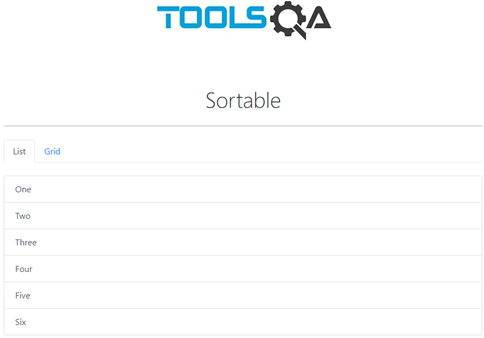
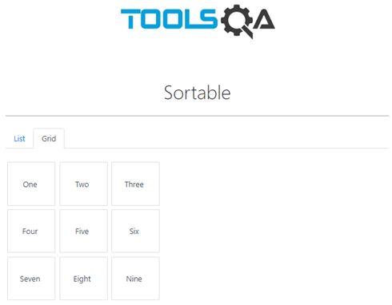

# **⚡️ToolsQA | Interactions | Sortable**

## **Description**

- As a QA learner,

- I want to test:

    - **Sortable list is displaying and working as expected.**
    - **Sortable grid is displaying and working as expected.**

- So that I can improve my testing skills for this scenario.

*****
## **🚩BUSINESS RULES SPEC**

**- For the component:**

    - The tabs “List” and “Gird” must be showing by default. 

    - The tab “List” must be opened by default showing the contained list of items.

**Expected behavior:**

- Only one tab can be displayed at once. 

- “List” and “Grid” items have to be able to be ordered in any possible order.

**For the “List” tab:**

Default order and List items:

- One

- Two

- Three

- Four

- Five

- Six

**WHEN:** any list item is dragged between other list items

**THEN:** it must stay in the selected order in the list where it's dropped

**Expected behavior:** List items have to be able to be stacked in any order.

**For the “Grid” tab:**

Default Grid items:

- One

- Two

- Three

- Four

- Five

- Six

- Seven

- Eight

- Nine

**Expected display:** 3 x 3 grid.

**Expected behavior:** List items have to be able to be stacked in any order.

**WHEN:** any grid item is dragged between other grid items

**THEN:** it must stay in the order in the grid where it's dropped.

## **Mockup**

***Tab "List"***

***Tab "Grid"***

