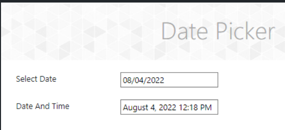
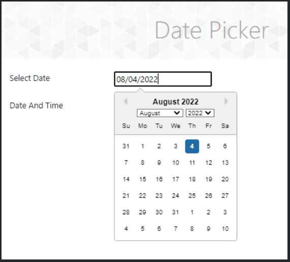
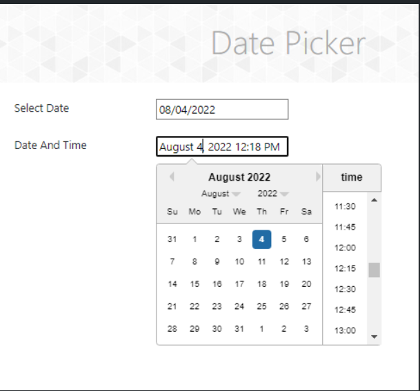

## QA Automation deberá:

_Realizar una implementación de código limpio siguiendo las mejores prácticas, utilizando las siguientes técnicas:_

**Page Object Model (POM): Implementar el patrón de diseño POM para lograr una estructura de código modular y mantenible.**

**Fixture (en caso de utilizar datos estáticos): Implementar un mecanismo de fixture para gestionar y reutilizar datos estáticos en las pruebas.**

**Selección aleatoria de elementos dentro de los calendarios: Desarrollar una funcionalidad que permita seleccionar elementos de forma aleatoria
dentro de los calendarios, con el objetivo de simular diferentes escenarios y garantizar una cobertura exhaustiva de las pruebas.**

**Aserción de cada elemento seleccionado del calendario: Asegurarse de incluir aserciones para verificar que cada elemento seleccionado del calendario
cumple con los criterios deseados. Esto implica comprobar que la fecha seleccionada sea la esperada y que cualquier otro atributo o comportamiento
relacionado esté correctamente validado.**

---

**Se evaluará la calidad del código, la organización y la claridad de la implementación, así como la capacidad para seguir las mejores prácticas de
automatización de pruebas. Asegúrate de documentar tu código y proporcionar comentarios claros para facilitar la comprensión.**

---

# As a QA Trainee L2

    I want to see the types of date pickers

    so I can learn more about widgets

---

## 🚩BUSINESS RULES SPEC

    Select Date Components

        Default values

            Current Date

        Input date

            Always appears a date with the following format:

                ${Month}/${Day}/${Year}

                    ${Month}: number of the month

        Year selection menu

            List of years (1900-2100)

        Month selection menu

            List of months in the year (January-December)

        Month pagination

            left arrow button: goes to the next month

            right arrow button: goes to the next month

        Current date

            Selected date: the day selected  background color is blue

    Select Date and time

        Input date

            Always appears a date with the following format:

                ${Month} ${Day} , ${Year} ${Time} ${acronym for time}

                    ${Month}: name of the month

                    ${Time}: appears only in the range of 1 to 12

                    ${acronym for time}: AM for morning and PM for the rest of the day

        Default values

            Current Date and time

        Year selection menu

            The selected year is marked with a √

        Month selection menu

            List of months in the year (January-December)

            The selected month is marked with a √

        Month pagination

            left arrow button: goes to the next month

            right arrow button: goes to the next month

        Current date

            Selected date: the day selected  background color is blue

        Timer Picker

            Selected time: the time selected background color is blue

            Time range of 00:00 to 23:45

---

## 🎴MOCKUP

# Date Picker

# Select Date

# Date and Time

